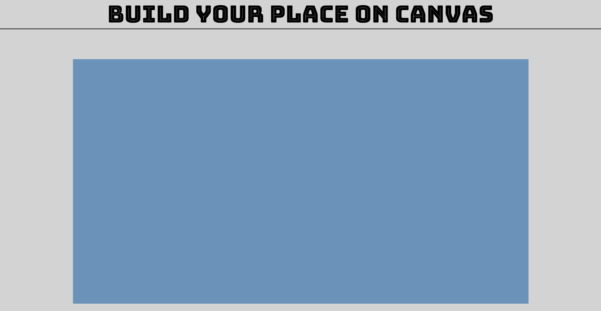

# Build Your Home
> A html5 Canvas Web App to Allow users adjust items drawing on Canvas, build with Gulp 

## [Demo](https://yuuki221.github.io/build_home/Demo/)

## Screenshots

## Instructions

Adjust the range bar to change the size or density of different object on canvas. 

